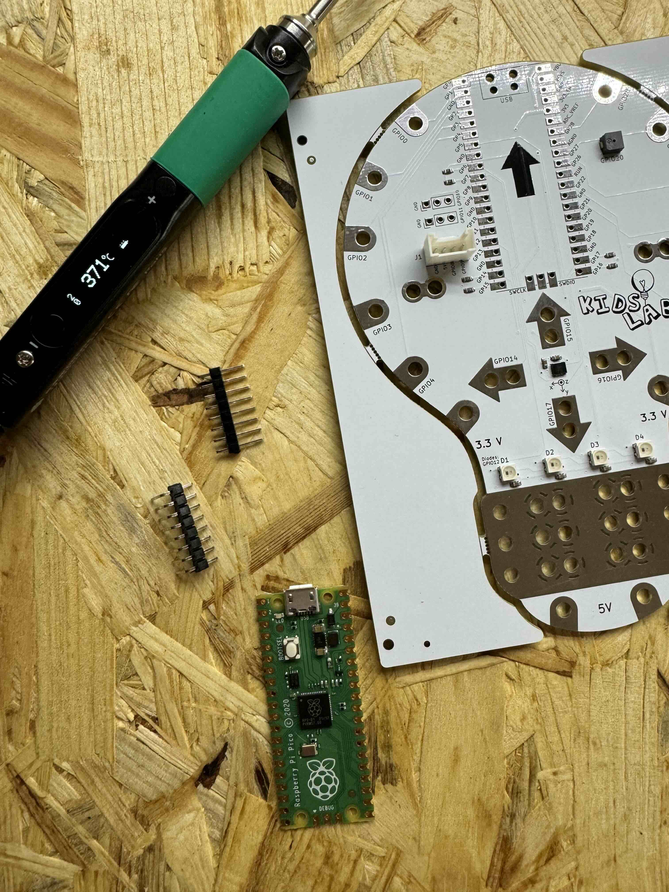
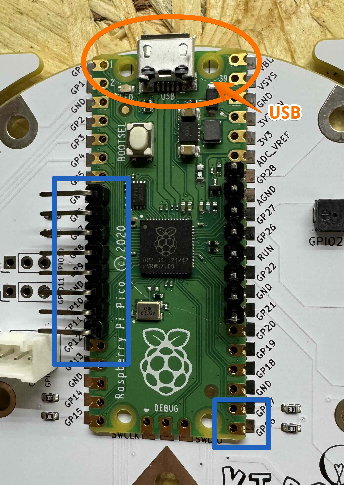
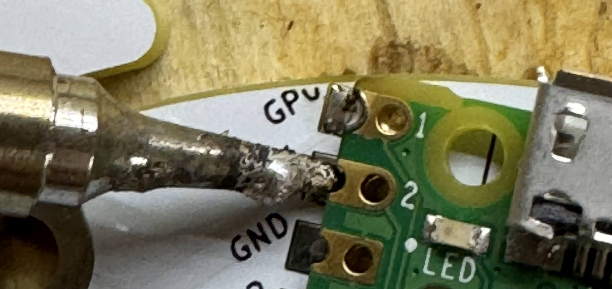
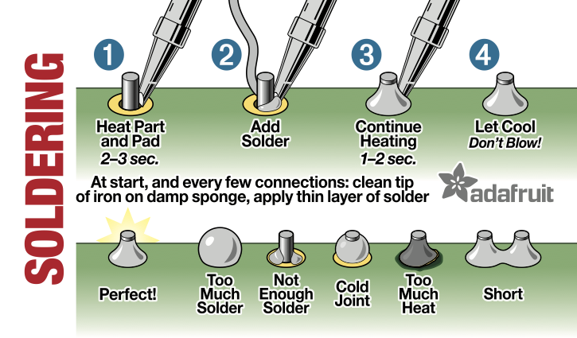
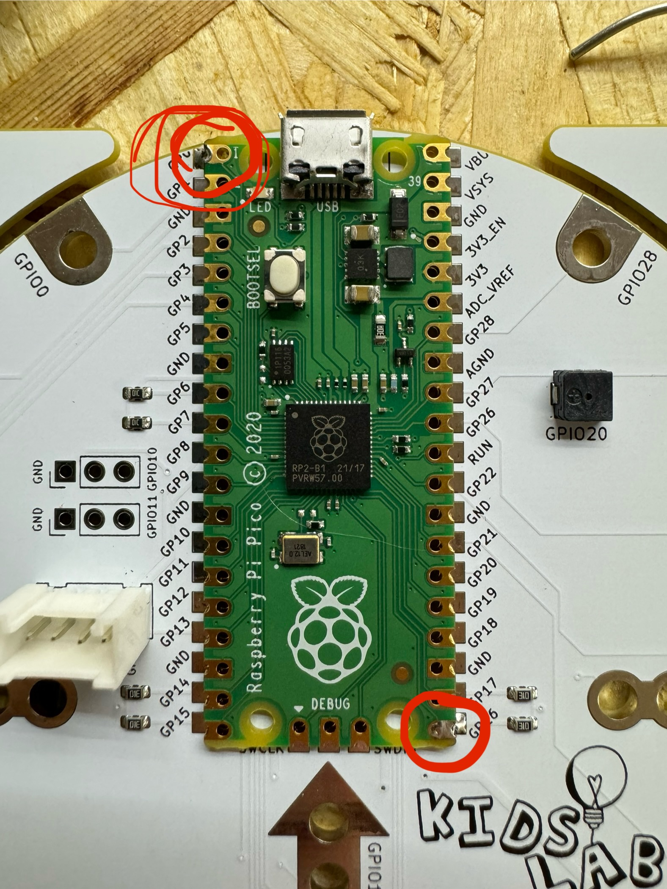
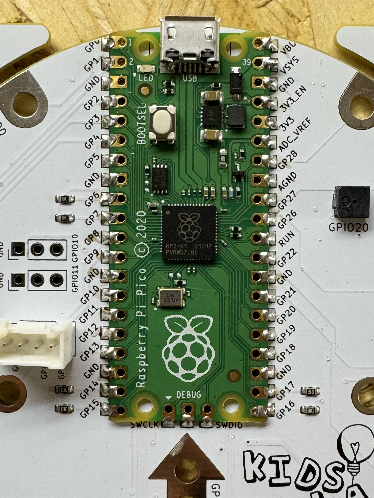
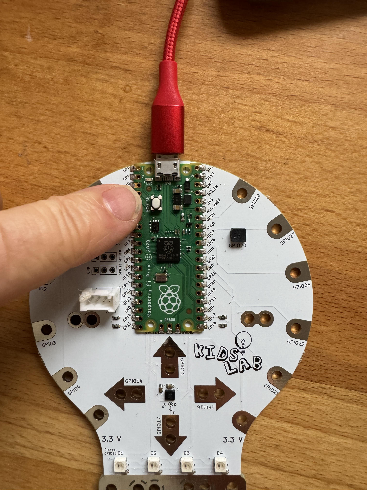
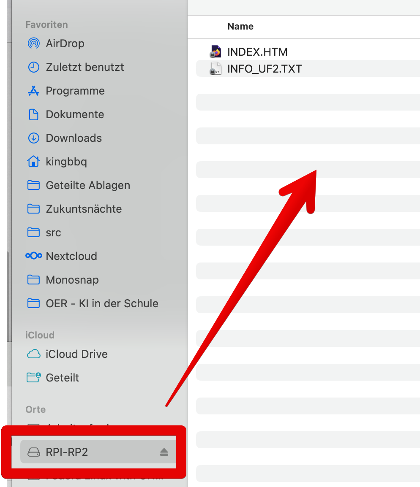
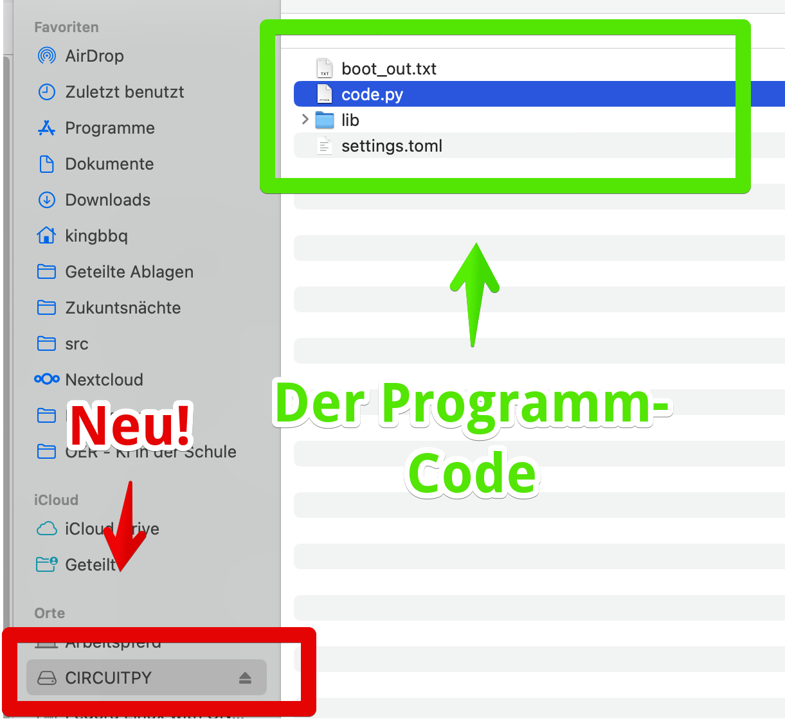

# Innovative Lernplatine mit Raspberry Pi Pico für angehende Programmierer

Diese benutzerfreundliche Platine ist speziell darauf ausgelegt, einen Raspberry Pi Pico aufzunehmen, und bietet eine interaktive Plattform, um die Grundlagen der Programmierung und Elektronik spielerisch zu erlernen.

**Hauptmerkmale:**

- **Vielseitiger Raspberry Pi Pico-Sockel:** Im Herzen der Platine befindet sich ein dedizierter Sockel, der perfekt für den Raspberry Pi Pico geeignet ist. Dies ermöglicht eine einfache Integration und eine robuste Verbindung.

- **Farbenfrohe LED-Anzeige:** Ausgestattet mit vier leuchtenden LEDs in verschiedenen Farben, bietet unsere Platine eine visuelle Rückmeldung für Programmierprojekte. Diese LEDs können für eine Vielzahl von Projekten programmiert werden, von einfachen Blinkmustern bis hin zu komplexeren Sequenzen.

- **Integrierter Neigungssensor:** Mit dem eingebauten Neigungssensor können Nutzer Bewegung und Ausrichtung in ihre Projekte einbeziehen. Dieser Sensor eröffnet spannende Möglichkeiten für interaktive Spiele und Experimente.

- **Kompakter Lautsprecher:** Ein kleiner, aber leistungsstarker Lautsprecher ermöglicht es, akustische Elemente in Projekte zu integrieren. Von einfachen Tonsignalen bis hin zu komplexen Melodien können die Nutzer ihre Kreativität voll ausleben.

- **Touch-Sensoren:** Die Platine verfügt über empfindliche Touch-Sensoren, die eine neue Dimension der Interaktivität bieten. Diese können für eine Vielzahl von Anwendungen genutzt werden, von Steuerelementen für Spiele bis hin zu kreativen musikalischen Experimenten.

- **Ideal für DIY-Gamecontroller:** Diese Platine ist nicht nur ein Lernwerkzeug, sondern auch eine Grundlage für den Bau eigener Gamecontroller. Nutzer können die vorhandenen Sensoren und Ausgänge verwenden, um einzigartige und individuelle Spieleerlebnisse zu schaffen.

**Anwendungsbereiche:**

Diese Platine ist ideal für Bildungseinrichtungen, Maker und alle, die einen praktischen und unterhaltsamen Einstieg in die Welt des Programmierens suchen. Sie bietet eine solide Grundlage für Projekte in den Bereichen Robotik, Spieleentwicklung und interaktive Kunst.

# Zusammenbau und erster Start

**Merke: Das Zusammenbauen ist nicht schwer - sie beim Löten zu brennen schmerzt dagegen sehr!** 

Daher immer auf die Finger obacht geben und den Lötkolben sicher ablegen!

## 1. Alles was du brauchst!

- Lötkolben, Lötzinn etc.
- 2 "Header" - die nutzen wir, um den Pico richtig auf der Platine zu platzieren. Im Notfall gehen auch 2 Büroklammern...
- einen [Raspberry Pico](https://www.berrybase.de/raspberry-pi-pico-rp2040-mikrocontroller-board) (oder [Pico W](https://www.berrybase.de/raspberry-pi-pico-w-rp2040-wlan-mikrocontroller-board))

## 2. Richtig platzieren

Lege den Pico auf die Platine. 

** Achtung - der USB-Stecker muss oben sein! **

Bitte achte auch darauf, dass der Pico nicht verschoben ist.

## 3. Let's Löt!

(Danke an Adafruit!)

- Lötkolben aufheizen
- Lötstelle mit Spitze berühren - am besten vor der Seite
- Etwas lötzinn zugeben
- 2-3 Sekunden warten!
- Jetzt etwas mehr Lötzinn von oben zugeben, es schmilzt an der Platine

Zuerst 2-3 Pins anlöten, zum Beispiel links oben und rechts unten - dann ist der Pico fest und du kannst die Header entfernen.

So sieht es aus, wenn alles fertig ist!

## 4. Anschließen und Software aufspielen!

- Stecke den Pico mit einem Micro-USB Kabel am Computer an.
- Wenn er neu ist, sollte er sofort wie ein USB-Stick auftauchen
- Wenn nicht, halte beim Anstecken die kleine weiße Taste "BOOTSEL" gedrückt.

So sieht das auf dem Mac aus:

(Bei Windows ein bisschen anders...)

Jetzt fehlt nur noch die "Firmware" - das ist die Basis-Software, damit der Pico Python sprechen kann: zusätzlich habe ich noch einen Beispiel-Python-Code drauf gemacht, dass es blinkt etc.

1. Lade diese Datei runter: https://github.com/KidsLabDe/PicoKrokoBirne/blob/main/firmware/PicoKrokoBirne.uf2
2. Kopiere sie auf die Pico im Finder / Explorer. Das geht meistens per Drag&Drop
3. Fertig!

Die PicoKrokoBirne sollte jetzt fröhlich bunt drauf losblinken!

## Anpassen und los programmieren!

Der Pico erscheint nun wiederum als USB-Laufwerk, diesmal heißt er "CIRCUITPY".
Dort findest du die Datei "code.py" - da drin passiert die Magie!

Als Editor empfehle ich dir den Mu-Editor: https://codewith.mu

Viel Spaß!

# Kontaktdaten

Du hast die Glühbirne als Visitenkarte bekommen? Sehr gut! 

Meine Kontaktdaten:

- Gregor Walter
- [gregor@kidslab.de](mailto:gregor@kidslab.de
- Telefon / WhatsApp: 0821-99951920 
- Mehr Infos über das gemeinnützige [KidsLab](https://kidslab.de) 

Ich freue mich auf deinen Anruf / eMail / Nachricht 🤖

